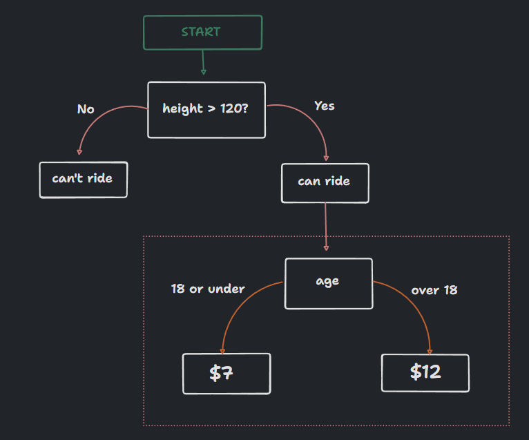
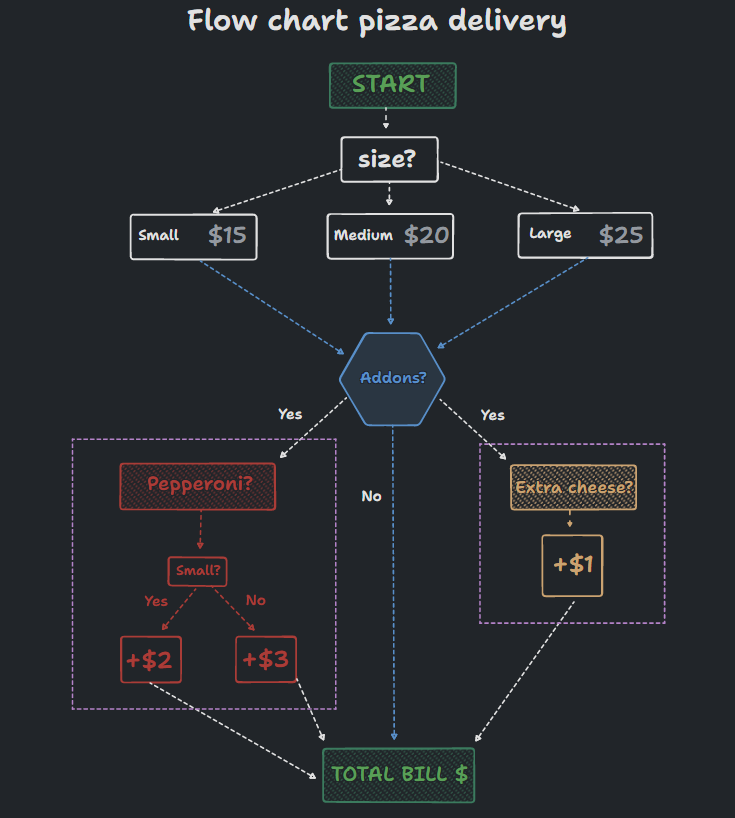
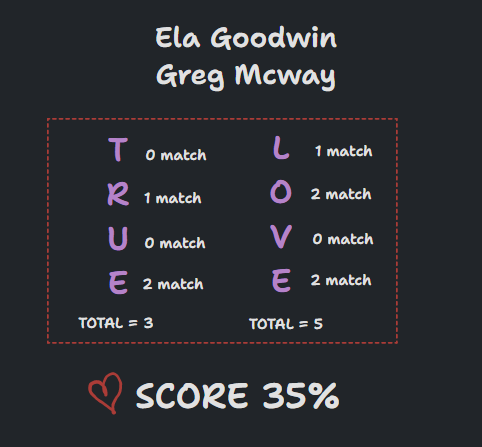
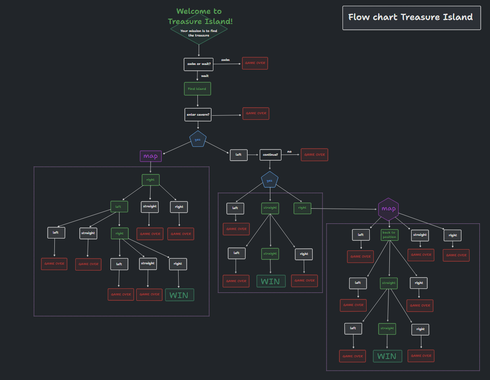

# Python journey


## Introduction

For this session, we'll learn control flow and logical operators.

## Summary

- [Requirements](#requirements)
- [Tools and version](#tools-and-versions)
- [Projects](#project)
  - even/odd
  - rollercoaster
  - BMI 2.0
  - leap year
  - pizza order program
  - love calculator
  - treasure island
- [Some tips](#tips)

- Useful resources :

  - [Sources](#sources)

## Requirements

Python installed and an IDE or online editor like: <https://replit.com/>

## Tools and versions

- OS

  - Linux OS -
  - Windows OS -

- IDE

  - VSCodium v1.77.3

- Techno
  - Python v3.11.3

## Project

### Even/Odd challenge

```python
print("Odd or even program =======")

number = int(input("What number do you want to check? \n"))

if number % 2 == 0:
    print("The number is even.")
else:
    print("The number is odd.")
```

### Rollercoaster challenge

Find the flow chart:



<details>

<summary>Solution</summary>

```python
if height > 120:
    print("You can ride the rollercoaster!")
    age= int(input("What is your age ?"))

    if age <= 18:
        print("The ticket price is $7.")
    else:
        print("The ticket price is $12.")
else:
    print("Sorry, you have to grow taller before you can ride.")
```

</details>

---

### BMI 2.0 challenge

```python
height = float(input("Enter your height in m: "))
weight = float(input("Enter your weight in kg: "))

bmi = round(weight / height**2)

if bmi < 18.5:
    print(f"According to your BMI which is {bmi}, your are underweight!")
elif bmi < 25:
    print(f"According to your BMI which is {bmi}, your have a normal weight!")
elif bmi < 30:
    print(f"According to your BMI which is {bmi}, your are overweight!")
elif bmi < 35:
    print(f"According to your BMI  which is {bmi}, your are obese!")
else:
    print(f"According to your BMI which is {bmi}, your are clinically obese!")
```

---

### Leap year challenge

A year is a leap year if the year is evenly divisible by 4 EXCEPT every year that is evenly divisible by 100 UNLESS the year is also evenly divisible by 400.

Here's the flow chart


<details>

<summary>Solution</summary>

```python
year = int(input("Which year do you want to check? \n"))

if (year % 4) == 0:
    if (year % 100) == 0:
        if (year % 400) == 0:
            print(f"This year {year} is a leap year!")
        else:
            print(f"This year {year} is not a leap year!")
    else:
        print(f"This year {year} is a leap year!")
else:
    print(f"This year {year} is not a leap year!")
```

</details>

---

### Rollercoaster 2.0

New flowchart


<details>

<summary>Solution</summary>

```python
print("Welcome to the rollercoaster!")
height = int(input("What is your height in cm? \n"))
child_ticket = 5
youth_ticket = 7
adult_ticket = 12
total_price = 0

if height > 120:
    print("You can ride the rollercoaster!")
    age= int(input("What is your age ? "))

    if age < 12:
        print(f"Child ticket price is ${child_ticket}.")
        total_price = child_ticket
    elif age <= 18:
        print(f"Youth ticket price is ${youth_ticket}.")
        total_price = youth_ticket
    else:
        print(f"Adult ticket price is ${adult_ticket}.")
        total_price = adult_ticket

    ask_photo = input("Would you like a photo? (yes/no) \n")
    if ask_photo == "yes":
        total_price += 3
        print(f"Ok, the total price is ${total_price}.")
    else:
        print(f"Ok, the total price is ${total_price}.")

else:
    print("Sorry, you have to grow taller before you can ride.")
```

</details>

---

### Pizza order program

Flowchart



<details>

<summary>Solution</summary>

```python
print("Welcome to Python Pizza deliveries!")
size = input("What size pizza do you want? S, M, or L? \n")
add_pepperoni = input("Do you want to add pepperoni? Y or N \n")
add_extra_cheese = input("Do you want to add extra cheese? Y or N \n")
price = 0

if size == "S":
    price = 15
elif size == "M":
    price = 20
else:
    price = 25

if add_pepperoni == "Y":
    if size == "S":
        price += 2
    else:
        price += 3

if add_extra_cheese == "Y":
    price += 1


print(f"The total bill is ${price}.")
```

</details>

### Love calculator

Use logical operators by creating a love calculator.

Instructions: Enter the full names of both people you want to check the Love Score for and the calculator will give you the percentage of Love Score match

Example:



For this challenge, we will use following functions:

```python
str()
int()
input()
count()

concatenation
logical operators
```

### Main program: Treasure Island

Big big flow chart:



---

## Tips

### IF/ELSE statements

```python
if condition:
    do that
else:
    do that
```

### Nested if/else

```python
if condition:
    if another condition:
      do this
    else:
      do this
else:
    do that
```

### Comparison operators

| Operator | Meaning                  |
| -------- | ------------------------ |
| >        | greater than             |
| <        | less than                |
| >=       | greater than or equal to |
| <=       | less than or equal to    |
| ==       | equal to                 |
| !=       | not equal to             |

### Multipe if

```python
if condition1:
  do A
if condition2:
  do B
if condition3:
  do C
```

### Logical operators

```txt
A and B => both have to be true
C or D => at least one have to be true
not E => reverse the condition
```

---

## Sources

- [Create ASCII draws](https://fsymbols.com/draw/)
- [TLdraw for flowcharts](https://www.tldraw.com/)